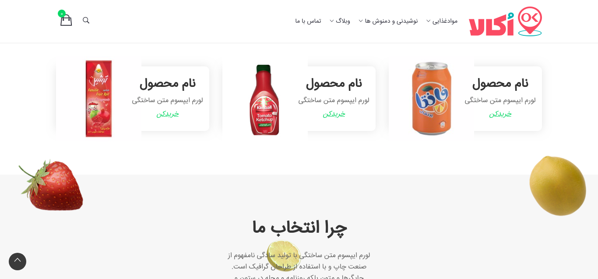

This project was bootstrapped with [Create React App](https://github.com/facebook/create-react-app).

## Available Scripts

In the project directory, you can run:

### `yarn start`

Runs the app in the development mode. 
Open [http://localhost:3000](http://localhost:3000) to view it in the browser.

## `Features include:`

When the shopping cart icon on product list is clicked, 
it will add to the number of shopping cart icon in the navbar.

Here we used context api and hooks to do this.

# Screenshots

